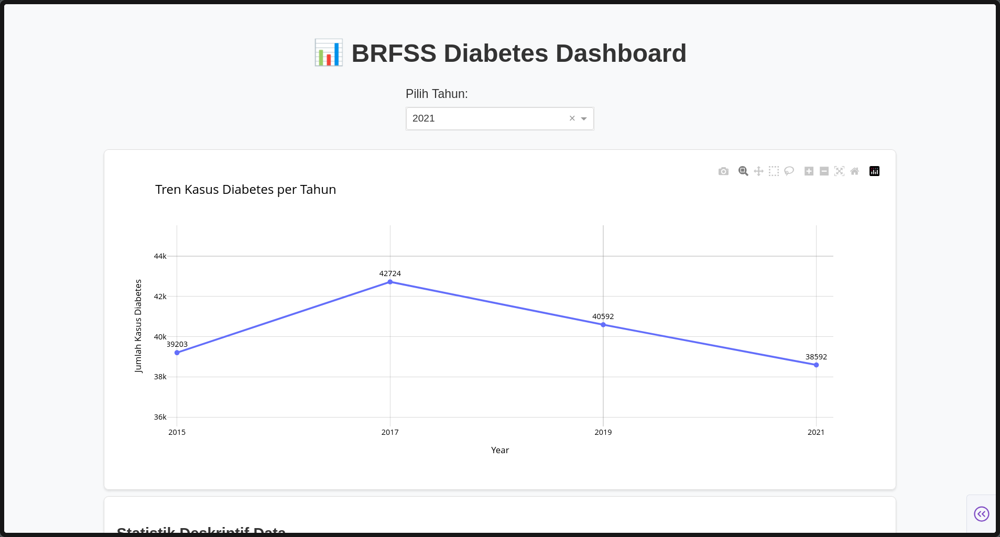

# BRFSS Data Engineering Pipeline

BRFSS Data Engineering is an end-to-end ELT and analytics pipeline for the Behavioral Risk Factor Surveillance System (BRFSS) dataset, focusing on diabetes and related health indicators. This project automates data extraction, transformation, validation, and visualization, providing both static and interactive dashboards for health data analysis.

---

## 📊 Dashboard Preview

<p align="center">
  
</p>

---

## Features

- **Automated ELT Pipeline**: Download, extract, and process BRFSS data for multiple years.
- **Data Validation**: Schema validation using [Pandera](https://pandera.readthedocs.io/).
- **Interactive Dashboard**: Explore trends, distributions, and correlations with [Dash](https://dash.plotly.com/).
- **Static Visualizations**: Automatically generated PNG charts for reporting.
- **Configurable**: Easily adjust years, features, and data sources via `config.yaml`.

---

## Project Structure

```
brfss-data-engineering/
│
├── config.yaml                # Main configuration file
├── prefect.yaml               # Prefect deployment configuration
├── requirements.txt           # Python dependencies
├── .gitignore
├── README.md
│
├── data/
│   ├── raw/                   # Downloaded raw .XPT files
│   └── processed/             # Processed .parquet files
│
├── logs/                      # ELT and validation logs
│
├── src/
│   ├── extract/               # Data extraction scripts
│   ├── transform/             # Data transformation & validation
│   ├── flow/                  # Prefect flows and pipeline
│   └── visualization/         # Dash app and chart utilities
│
└── visualizations/            # Static PNG charts (auto-generated)
```

---

## Getting Started

### 1. Clone the Repository

```bash
git clone https://github.com/yourusername/brfss-data-engineering.git
cd brfss-data-engineering
```

### 2. Install Dependencies

It is recommended to use a virtual environment:

```bash
python3 -m venv .venv
source .venv/bin/activate
pip install -r requirements.txt
```

### 3. Configure the Pipeline

Edit `config.yaml` to set the desired years and data directories:

```yaml
dataset:
  start_year: 2015
  url_template: "https://www.cdc.gov/brfss/annual_data/{year}/files/LLCP{year}XPT.zip"
  raw_dir: "data/raw/"
  processed_dir: "data/processed/"
```

### 4. Start Prefect Server

Start the Prefect server locally:

```bash
prefect server start
```

In a new terminal, set the Prefect API URL:

```bash
prefect config set PREFECT_API_URL=http://127.0.0.1:4200/api
```

### 5. Create and Start Prefect Worker

Create a Prefect worker (if not already created), then start it:

```bash
prefect worker start --pool "my-work-pool"
```

### 6. Deploy and Run the ELT Pipeline

Deploy the pipeline:

```bash
prefect deploy
```

Then run the deployment:

```bash
prefect deployment run 'etl-pipeline/brfss-yearly'
```

- Processed data will be saved in `data/processed/`.
- Logs are written to `logs/`.

### 7. Launch the Dashboard

After the ELT process is complete, the dashboard will be available at [http://localhost:8050](http://localhost:8050):

---

## References

- [CDC BRFSS Data](https://www.cdc.gov/brfss/annual_data/annual_data.htm)
- [Prefect Documentation](https://docs.prefect.io/)
- [Dash by Plotly](https://dash.plotly.com/)
- [Pandera](https://pandera.readthedocs.io/)

---

## License

This project is licensed under the MIT License. See [LICENSE](LICENSE) for details.

